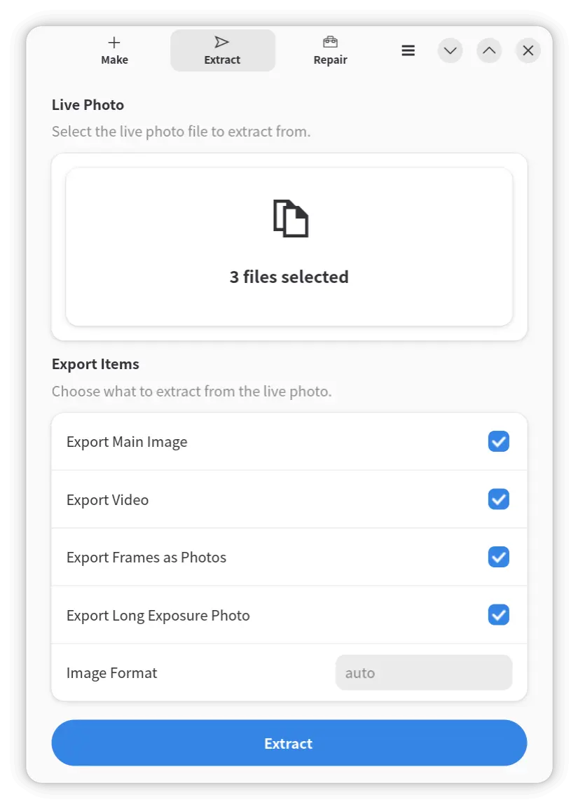
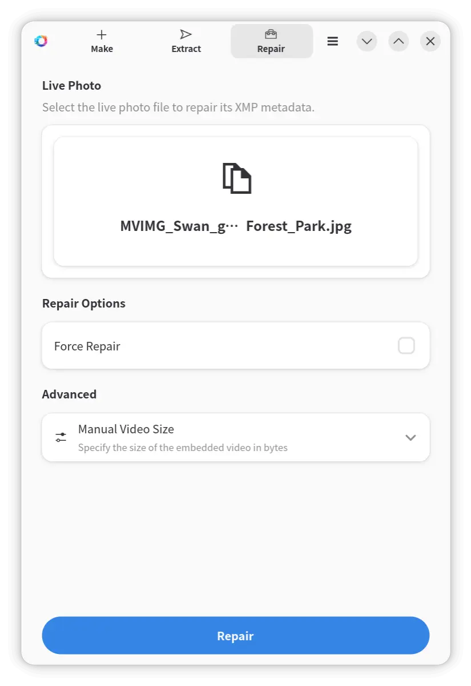

# Live Photo Converter

<div align="center">
  
</div>

[](https://deepwiki.com/wszqkzqk/live-photo-conv)

* [English Version](README.md)

Live Photo Converter 是一个用于处理动态照片的跨平台的工具，提供了基于 GTK4 / LibAdwaita 的现代化的图形界面、命令行工具与函数库。

它可以将静态图像和视频合成为动态照片，直接将视频转化为动态照片，修复受损的动态照片，或者从动态照片中提取静态图像和视频，还可以将视频的每一帧导出为图片，并支持将动态照片转换为长曝光照片。

## 功能

- `live-photo-conv-gtk`
  - **图形界面**（GTK4 / LibAdwaita）程序，全面支持制作、提取和修复动态照片
- `live-photo-make`
  - 从图片和视频**创建**动态照片
- `live-photo-extract`
  - 从动态照片中提取图片、视频和**视频帧**
  - 将动态照片转换为**长曝光照片**
- `live-photo-repair`
  - **修复**损坏的动态照片
- `live-photo-conv`
  - 功能全面的通用命令，用于创建、提取、转换和修复动态照片
- `copy-img-meta`
  - 从一张图片复制元数据到另一张图片
  - 可以选择复制或排除 EXIF、XMP、IPTC 元数据
- `liblivephototools`
  - 一个可用于创建和提取动态照片以及从内嵌视频中导出帧的库
  - 可以在支持 **GObject Introspection** 的**任何**语言中使用

## [背景](https://wszqkzqk.github.io/2024/08/01/%E8%A7%A3%E6%9E%90Android%E7%9A%84%E5%8A%A8%E6%80%81%E7%85%A7%E7%89%87/)

Android 的动态照片是一种逐渐普及的媒体文件格式，它可以将包含音频的视频与静态图片结合在一起，形成一个动态的照片。这种照片已经在多种机型上得到了支持，例如 Google 的 Pixel 系列、三星的 Galaxy 系列，以及小米等厂商的大部分机型。

Android 动态照片本质上是在静态图片的末尾直接附加了一个视频文件，这个视频文件包含了音频与视频流。其中，视频文件的位置使用 `XMP` 元数据进行标记，这样在解析时可以快速找到视频文件的位置。这种格式的好处是可以在不改变原有图片的情况下，为图片添加动态效果。由于这一拓展并非图片格式的标准，因此在不支持的图片查看器上，这种图片只能被当作静态图片显示。

本工具可以用于这种动态照片的提取、修复、编辑与合成等操作。

## 便捷安装

### Android（实验性）

从 [GitHub Releases](https://github.com/wszqkzqk/live-photo-conv/releases) 下载对应设备 ABI 的 APK 并安装（可能需要允许浏览器或文件管理器"安装未知来源应用"）：

* `*-android-arm64-v8a.apk`
  * 绝大多数现代手机和平板
* `*-android-x86_64.apk`
  * x86 设备和模拟器
* `*-android-universal.apk`
  * 通用包，适用于所有支持的 ABI，但体积更大

Android 平台仅提供图形界面，视频处理由静态链接的 GStreamer 后端完成。需要 Android 12 及以上版本。

### Windows (MSYS2)

对于 Windows 用户，现在 **[MSYS2](https://www.msys2.org/) 官方仓库**中已经包含了[该软件包](https://packages.msys2.org/base/mingw-w64-live-photo-conv)，确保已经安装并更新了 MSYS2 后，可以直接使用 `pacman` 进行安装（以 UCRT64 环境为例）：

```bash
pacman -S mingw-w64-ucrt-x86_64-live-photo-conv
```

### Arch Linux

Arch Linux 可以直接从 AUR 安装，例如使用 AUR 助手 `paru`：

```bash
paru -S live-photo-conv
```

也可以手动克隆 AUR 仓库并构建、安装：

```bash
git clone https://aur.archlinux.org/live-photo-conv.git
cd live-photo-conv
makepkg -si
```

### Flatpak

从 [GitHub Releases](https://github.com/wszqkzqk/live-photo-conv/releases) 下载 `.flatpak` 包并安装（推荐）：

```bash
flatpak install --user live-photo-conv*.flatpak
```

使用 flatpak-builder 从源码构建：

```bash
git clone https://github.com/wszqkzqk/live-photo-conv.git
cd live-photo-conv
flatpak install --user flathub org.gnome.Sdk//50 org.gnome.Platform//50
flatpak-builder --user --install --force-clean build-flatpak com.github.wszqkzqk.live-photo-conv.yml
flatpak run com.github.wszqkzqk.live-photo-conv
```

### macOS (Homebrew)

macOS 可以将本仓库作为 Homebrew tap 安装：

```bash
brew tap wszqkzqk/live-photo-conv https://github.com/wszqkzqk/live-photo-conv
HOMEBREW_NO_REQUIRE_TAP_TRUST=1 brew install --HEAD wszqkzqk/live-photo-conv/live-photo-conv
```

## 手动构建

### 依赖

* 构建依赖
  * Meson、Vala、GExiv2
  * GTK4、LibAdwaita（可选，GUI 需要）
  * GStreamer（`gstreamer`, `gst-plugins-base-libs`）— 可选，用于从视频导出图片，否则使用 FFmpeg
  * gdk-pixbuf2 — 可选，同上
  * gobject-introspection — 可选，用于生成 GObject Introspection 信息
* 运行依赖
  * GLib（GObject, GIO）、GExiv2
  * GTK4、LibAdwaita（GUI 需要）
  * GStreamer（`gstreamer`, `gst-plugins-base-libs`, `gst-plugins-good`, `gst-plugins-bad`）— GStreamer 构建时需要；`gst-plugin-va` 可选，用于硬件加速
  * gdk-pixbuf2 — GStreamer 构建时需要；可选格式加载器：`libavif` (.avif)、`libheif` (.heif/.heic/.avif)、`libjxl` (.jxl)、`webp-pixbuf-loader` (.webp)
  * FFmpeg（5.1 及以上）— 可选，未使用 GStreamer 构建时从视频导出图片需要

例如，在Arch Linux上安装依赖：

```bash
sudo pacman -S --needed glib2 gexiv2 meson vala gtk4 libadwaita gstreamer gst-plugins-base-libs gdk-pixbuf2 gobject-introspection gst-plugins-good gst-plugins-bad gst-plugin-va
```

在Debian/Ubuntu上安装依赖：

```bash
sudo apt install build-essential meson valac libgexiv2-dev libglib2.0-dev libgtk-4-dev libadwaita-1-dev libgstreamer1.0-dev libgstreamer-plugins-base1.0-dev libgdk-pixbuf-2.0-dev gobject-introspection libgirepository1.0-dev gstreamer1.0-plugins-good gstreamer1.0-plugins-bad gstreamer1.0-vaapi
```

在 macOS 上使用 Homebrew 安装依赖：

```bash
brew install meson vala pkgconf glib gexiv2 gtk4 libadwaita adwaita-icon-theme gstreamer gdk-pixbuf gobject-introspection ffmpeg help2man
```

在Windows的MSYS2（UCRT64）环境上安装依赖：

```bash
pacman -S --needed mingw-w64-ucrt-x86_64-glib2 mingw-w64-ucrt-x86_64-cc mingw-w64-ucrt-x86_64-gexiv2 mingw-w64-ucrt-x86_64-meson mingw-w64-ucrt-x86_64-vala mingw-w64-ucrt-x86_64-gtk4 mingw-w64-ucrt-x86_64-libadwaita mingw-w64-ucrt-x86_64-gstreamer mingw-w64-ucrt-x86_64-gst-plugins-base mingw-w64-ucrt-x86_64-gdk-pixbuf2 mingw-w64-ucrt-x86_64-gobject-introspection mingw-w64-ucrt-x86_64-gst-plugins-good mingw-w64-ucrt-x86_64-gst-plugins-bad
```

### 编译

使用 Meson 和 Ninja 构建项目，使用 Meson 配置构建时默认自动检测是否支持 GStreamer 与是否可以生成GObject Introspection 信息。

Meson 构建选项：

* `gst`
  * 是否启用 GStreamer
  * 可选值为 `auto`、`enabled`、`disabled`，默认为 `auto`
* `gir`
  * 是否生成 GObject Introspection 信息
  * 可选值为 `auto`、`enabled`、`disabled`，默认为 `auto`
* `gui`
  * 是否构建 GTK4/LibAdwaita 图形界面
  * 可选值为 `auto`、`enabled`、`disabled`，默认为 `auto`
* `docs`
  * 是否在 GObject Introspection 信息中生成文档
  * 可选值为 `auto`、`enabled`、`disabled`，默认为 `auto`
* `manpages`
  * 是否生成 man 手册
  * 可选值为 `auto`、`enabled`、`disabled`，默认为 `auto`

首先需要克隆项目并进入项目顶级目录，后续给出的参考命令均需要在**项目顶级目录**下执行：

```bash
git clone https://github.com/wszqkzqk/live-photo-conv.git
cd live-photo-conv
```

可以通过以下命令配置构建：

```bash
meson setup builddir --buildtype=release
```

可以使用 Meson 构建选项配置构建，例如，如果不想生成 GObject Introspection 信息，可以使用以下命令：

```bash
meson setup builddir --buildtype=release -D gir=disabled
```

然后编译项目：

```bash
meson compile -C builddir
```

安装项目：

```bash
meson install -C builddir
```

## 使用

### `live-photo-conv-gtk`（图形界面）

图形界面提供了直观的方式来制作、提取和修复动态照片，无需使用命令行。从应用启动器或终端启动：

```bash
live-photo-conv-gtk
```

三个标签页覆盖所有操作：

* **Make** — 将视频及主图片合成为动态照片。可拖放文件或点击浏览，然后点击按钮选择保存位置。

  <p align="center"></p>

* **Extract** — 选择动态照片，勾选要导出的内容（主图片、视频、长曝光、逐帧），选择输出目录。支持**批量处理**多个动态照片。

  <p align="center"></p>

* **Repair** — 修复动态照片中损坏的 XMP 元数据。如有需要，可展开高级选项手动指定视频大小。支持**批量处理**多个动态照片。

  <p align="center"></p>

### CLI 工具

为了方便常见操作，此项目提供了几个命令行工具。运行任意命令加 `--help` 可查看所有可用选项：

* `live-photo-make`：创建动态照片。
* `live-photo-extract`：提取图片、视频和视频帧。
* `live-photo-repair`：修复损坏的动态照片。
* `live-photo-conv`：功能全面的通用命令。
* `copy-img-meta`：复制图片元数据。

#### `live-photo-make`

```bash
live-photo-make -i /path/to/image.jpg -m /path/to/video.mp4 -o /path/to/output.jpg
```

将视频直接转化为动态照片：

```bash
live-photo-make -m /path/to/video.mp4 -o /path/to/output.jpg
```

主要选项：`-i`（图片）、`-m`（视频，必需）、`-o`（输出）、`--drop-metadata`、`--use-ffmpeg` / `--use-gst`。

#### `live-photo-extract`

```bash
live-photo-extract -p /path/to/live_photo.jpg -d /path/to/dest
```

提取并逐帧导出：

```bash
live-photo-extract -p /path/to/live_photo.jpg -d /path/to/dest --frame-to-photos -f avif
```

仅生成长曝光照片：

```bash
live-photo-extract -p /path/to/live_photo.jpg -l /path/to/long_exposure.jpg --minimal
```

主要选项：`-p`（动态照片，必需）、`-d`（输出目录）、`-i`（图片）、`-m`（视频）、`-l`（长曝光）、`--frame-to-photos`、`-f`（图片格式）、`-T`（线程数）、`--minimal`、`--drop-metadata`。

#### `live-photo-repair`

```bash
live-photo-repair -p /path/to/live_photo.jpg
```

强制修复：

```bash
live-photo-repair -p /path/to/live_photo.jpg -f
```

主要选项：`-p`（动态照片，必需）、`-f`（强制）、`-s`（手动指定视频大小）。

#### `live-photo-conv`（通用命令）

与简化命令类似，但需用 `--make`、`--extract`、`--repair` 指定模式：

```bash
live-photo-conv --make -i /path/to/image.jpg -m /path/to/video.mp4 -p /path/to/output.jpg
live-photo-conv --extract -p /path/to/live_photo.jpg -d /path/to/dest
live-photo-conv --repair -p /path/to/live_photo.jpg
```

#### `copy-img-meta`

```bash
copy-img-meta /path/to/source.jpg /path/to/dest.webp
```

选择不复制某些元数据：

```bash
copy-img-meta --exclude-xmp --exclude-iptc /path/to/source.jpg /path/to/dest.webp
```

主要选项：`--exclude-exif` / `--with-exif`、`--exclude-xmp` / `--with-xmp`、`--exclude-iptc` / `--with-iptc`。

### `liblivephototools`

* **警告：** 该库的API可能会随着版本的更新而发生变化。

`liblivephototools` 是一个用于创建和提取动态照片以及从内嵌视频中导出帧的库。它可以在支持 **GObject Introspection** 的**任何**语言中使用，例如 C、Vala、Rust、C++、Python 等。

#### 示例

以 Python 为例，确保已经安装了 `python-gobject` 包，然后可以通过以下代码导入库：

```python
import gi
gi.require_version('LivePhotoTools', '0.5') # 请根据实际版本号调整
from gi.repository import LivePhotoTools
```

使用示例：

```python
# 加载动态照片
livephoto = LivePhotoTools.LivePhoto.create("MVIMG_20241104_164717.jpg", None, LivePhotoTools.Backend.AUTO)
# 从动态照片中提取静态图像
livephoto.export_main_image()
# 从动态照片中提取视频
livephoto.export_video()
# 从内嵌视频中导出帧
livephoto.split_images_from_video(None, None, 0)
# 将动态照片转换为长曝光照片
livephoto.generate_long_exposure("long_exposure.jpg")
```

```python
# 创建动态照片
livemaker=LivePhotoTools.LiveMaker.create('VID_20241104_164717.mp4', 'IMG_20241104_164717.jpg', None, LivePhotoTools.Backend.AUTO)
# 导出
livemaker.export()
```

## 许可证

该项目使用 LGPL-2.1-or-later 许可证。详细信息请参阅 [`COPYING`](COPYING) 文件。

## FAQ

### 由嵌入视频导出图片：用 FFmpeg 还是用 GStreamer？

如果在构建时启用了GStreamer支持，那么默认将使用GStreamer来从嵌入视频中导出图片。否则，程序将直接尝试通过命令的方式创建FFmpeg子进程来导出图片。在启用了GStreamer支持的情况下，也可以通过`--use-ffmpeg`选项来使用FFmpeg。

使用GStreamer与FFmpeg导出谁更快往往并不一定。笔者构建的GStreamer视频导出图片工具的编码是并行的，可以通过调整`-T`/`--threads`选项来控制线程数。但是目前笔者没有将GStreamer的解码部分优化得很好，每次得到帧都进行了强制的颜色空间转化（[`gdk-pixbuf2`的限制](https://docs.gtk.org/gdk-pixbuf/property.Pixbuf.colorspace.html)），这也可能会引入性能损耗。因此，目前综合来看：

* 所选的图片编码较慢时，GStreamer导出图片更快
* 所选的图片编码较快时，FFmpeg导出图片更快

### Windows 下的路径编码：无法向包含非 ASCII 字符的路径读取或写入元数据

由于 Exiv2 的限制与 GExiv2 绑定的不完善，目前无法在 Windows 下向包含非 ASCII 字符的路径读取或写入元数据。

### Android 手机厂商的分裂：无法识别动态照片

由于 Android 手机厂商的分裂，不同厂商还可以需要动态照片中有自己的"私货"元数据才能识别动态照片。可能直接使用本工具生成的动态照片在某些手机上无法识别。

解决方案：

* 使用对应厂商的手机拍摄一张普通照片
* 使用 `copy-img-meta --exclude-xmp <source_image> <dest_image>` 将这张照片的元数据复制到生成的动态照片上
* 如果在手机上发现能识别但无法播放，使用 `live-photo-conv` 工具修复动态照片
  * 例如，使用 `live-photo-conv --repair -p /path/to/live_photo.jpg`
  * 或者强制修复 `live-photo-conv --force-repair -p /path/to/live_photo.jpg`
  * 极少数情况下如果仍然无法修复，可以尝试指定嵌入视频大小 `live-photo-conv --repair-with-video-size=SIZE -p /path/to/live_photo.jpg` （一般情况下不需要）

也可以事先先将元数据复制到用来制作动态照片的普通照片上，然后再使用 `live-photo-conv` 工具创建动态照片（推荐）：

```bash
copy-img-meta --exclude-xmp /path/to/source.jpg /path/to/dest.jpg
live-photo-conv --make --image /path/to/dest.jpg --video /path/to/video.mp4 --live-photo /path/to/output.jpg
```

这样可以一次性得到可以在对应品牌的手机上正常识别的动态照片。

## 贡献

### 代码贡献

本项目使用 [Meson](https://mesonbuild.com/) 构建系统，主要使用 **Vala** 语言。构建方法参见 [手动构建](#手动构建)。[Pull Request](https://github.com/wszqkzqk/live-photo-conv/pulls) 请提交至 `main` 分支。

### 翻译

翻译在 [Hosted Weblate](https://hosted.weblate.org/projects/live-photo-conv/) 上管理。请使用 Weblate 贡献翻译，不要提交翻译内容的 Pull Request。

[](https://hosted.weblate.org/projects/live-photo-conv/)
